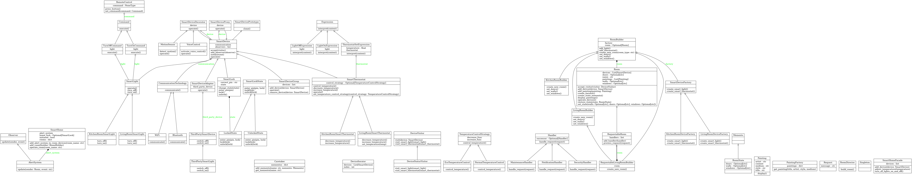

# N-Design Patterns In One Python Project

## Overview
This project, SmartHomeSystem, provides an example of implementing 20 different design patterns in Python. The aim is to showcase these patterns in a coherent system, providing a practical reference for Python developers interested in design patterns.

## Design Patterns

The design patterns are grouped into three categories: Creational, Structural, and Behavioral.

### Creational Patterns
* **Abstract Factory**: Used to create families of related objects, demonstrated with a set of "Smart Devices".
* **Builder**: Shows how to configure complex objects step by step with a RoomBuilder.
* **Prototype**: Demonstrates how to clone a pre-configured device instead of creating a new one from scratch.
* **Singleton**: Used to manage all operations in the system with a single "Home" object.

### Structural Patterns
* **Adapter**: Demonstrates how to enable classes with incompatible interfaces to collaborate.
* **Bridge**: Shows how to decouple an abstraction from its implementation.
* **Composite**: Used to compose objects into tree structures to represent part-whole hierarchies.
* **Decorator**: Demonstrates how to add responsibilities to objects dynamically.
* **Facade**: Simplifies complex system interactions with a unified high-level interface.
* **Flyweight**: Shows how to use sharing to support large numbers of fine-grained objects efficiently.
* **Proxy**: Provides a surrogate or placeholder for another object to control access to it.

### Behavioral Patterns
* **Chain of Responsibility**: Demonstrates creating a chain of receiver objects for a request.
* **Command**: Shows how to encapsulate a request as an object.
* **Interpreter**: Implemented a language interpreter for a 'Smart Device' programming language.
* **Iterator**: Allows access to the elements of an aggregate object sequentially without exposing its underlying representation.
* **Memento**: Demonstrates how to capture and externalize an object's internal state.
* **Observer**: Shows how to define a one-to-many dependency between objects.
* **State**: Allows an object to alter its behavior when its internal state changes.
* **Strategy**: Demonstrates defining a family of algorithms, encapsulating each one, and making them interchangeable.
* **Visitor**: Represents an operation to be performed on the elements of an object structure.

## Not Yet Implemented
The following two patterns are not used currently. If you have good ideas about how to implement these, please share!

* **Template Method**
* **Mediator**
* **Factory** (Covered by **Abstract Factory**)

## Contribution
Contributions are welcome! Please feel free to submit a pull request or open an issue.
